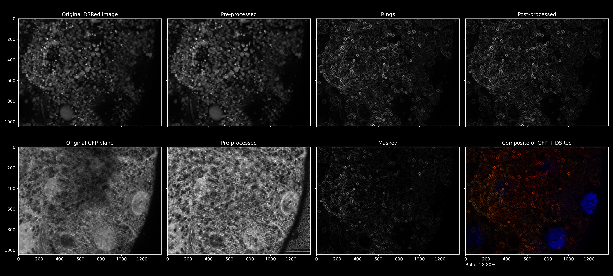

# gfp-ring-detector

Analyzes granular level fluorescent microscopy images and
counts the amount of granules with and without rings on their membrane.

Made for use at ELTE Anatómiai Sejt- és Fejlődésbiológiai Tanszék,
especially in context of the role of ubiquitin in cell autophagy.

## Dependencies

See [`conda-env.yml`](conda-env.yml).

`order.sh` uses symbolic links, so linux is recommended.

Tested using zsh.

## Notable executables

### `pipeline.py`

Main product.

Analyzes an image and saves the result or (in _interactive mode_) displays it using the 5D Viewer.

- [ ] **TODO** Exit as soon as 5D Viewer is closed
- [ ] **TODO** Open 5D Viewer early and push new images in realtime
- [ ] **TODO** Measure and estimate computing time of each step

#### Arguments

1. `fname_template` \[semi-mandatory]  
   Filename of all channel images. Use `{}` to denote the channel number. 
   Example: `python pipeline.py "képek/MyImage_z1_c{}.tif"`
2. `folder` \[optional]  
   Output folder. If not supplied, interactive mode is activated. If supplied
   empty string (`python pipeline.py "képek/MyImage/MyImage_c{}.tif" ""`),
   the parent folder of the channel images is used.

### `process_all.sh`

Walks the dataset in the `képek/` folder looking for folders named `*_Files`,
and analyzes the `*_c<channel num>.tif` files 
(channel num should be 0, 1 and 2) in it using `pipeline.py`.

- [ ] **TODO** Estimate finishing time
- [ ] **TODO** Communicate between parallel instances
- [ ] **TODO** Ability to spawn sub-processes automatically

#### Arguments

1. `NUM_INSTANCES` \[optional]  
   Number of threads this script was started **manually**. 
   The script does not spawn sub-processes but is designed
   to be started more times in parallel.
2. `INSTANCE_ID` \[mandatory if `NUM_INSTANCES` specified]  
   An unique number between 1 and `NUM_INSTANCES`. The script will
   ignore all except every `NUM_INSTANCES`th file, this argument
   specifies which to process.

### `order.sh`

Walks the `képek/` folder, and if it finds a `stats.txt` named file,
links the folder of the file (and the `composite.tif` file from it)
to the newly-created `ordered/` folder.

Also creates a `files.zip` file with the most notable files
from the `ordered/` folder.

To prevent emptying the `ordered/` folder, set the `NO_RM` env var to
a non-empty value.

- [ ] **TODO** `STREAMING` environment variable not really works, 
      fix and document it

#### Preconditions

- _\[optional]_ Run `generate-composites.sh` once for the dataset or you'll get some broken links
- Run `process_all.sh` in order to initialize and/or refresh the statistics for each image

### `generate-composites.sh`

Walks the `képek/` folder, and if it finds any relevant microscopy image,
creates one named `composite.tif` and one named `composite.jpg`.

Useful for `order.sh`

## Other tools

### `import_multipoint.ijm`

ImageJ macro for importing generated coordinate lists

### `process_feh.sh`

Useful if `feh ordered/` command was issued. Finds the open feh window's
title, extracts the folder, and analyzes the images in it using
`pipeline.py` interactively.

- [ ] **TODO** React to a hotkey in the background

### `find-same.py`

Locates the original raw files of `steps.jpg` in the local `képek/` folder

### `find-centers.py`

Performs grayscale Hough transformation on the input image.

Note: We are cheating, it's just a convolution with a ring-shaped kernel, but more precise

### `update.sh`

Downloads the dataset from OneDrive if everything is properly configured

#### Arguments

1. `zvi_file`  
   Input image. The 3rd zoom is considered from it.

### `5d.py`

Opens a 4D ZVI file in 5D Viewer

#### Arguments:

1. `zvi_file`  
   The Zeiss Microscopy Image to open in 5D Viewer

## Demo

Here is a low resolution demonstration of the internals of the first iteration, from 2021H2:

## License

Not determined yet. Please ask the author ([Domonkos Lezsák](https://domonkos.lezsák.hu/contacts)) if you are planning to use this software.

If the author is unavailable for three months, consider this repository to be licensed under CC-NC-BY-SA.
